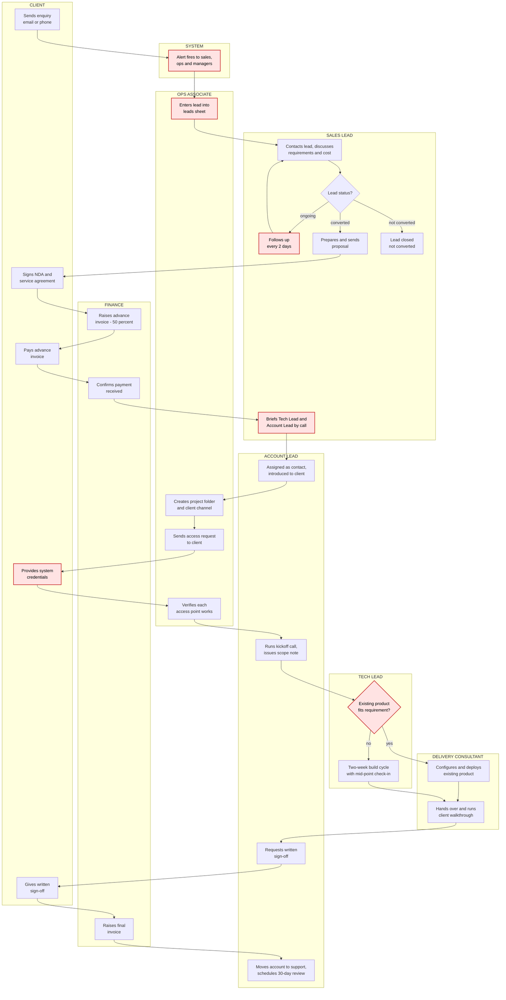

# Current State: Client Onboarding

**Document:** 01 of 05 - Current State Map
**Version:** 1.0
**Last updated:** August 2026
**Scope:** Enquiry received through to delivery signed off and account moved to ongoing support

---

## Process steps

| # | Step | Owner | Stage |
|---|---|---|---|
| 1 | Enquiry arrives by contact email or phone. Alert fires to sales leads, ops team, and managers simultaneously | System | Lead |
| 2 | Lead details entered into the leads sheet | Ops Associate | Lead |
| 3 | Sales contacts the lead; requirements and cost discussed | Sales Lead | Lead |
| 4 | Lead marked converted / ongoing / not converted | Sales Lead | Lead |
| 5 | Ongoing leads followed up every 2 days until converted or dropped | Sales Lead | Lead |
| 6 | Proposal document prepared with scope and pricing, sent to client | Sales Lead | Contract |
| 7 | NDA and service agreement signed by both parties | Sales Lead / Client | Contract |
| 8 | Advance invoice raised at 50 percent of engagement value | Finance | Contract |
| 9 | Advance payment received and confirmed. Work does not begin before this | Finance / Client | Contract |
| 10 | Internal handoff call: sales briefs Tech Lead and Account Lead on requirements, constraints, and commitments made during the sales conversation | Sales Lead | Handoff |
| 11 | Account Lead assigned as ongoing point of contact and introduced to client by email. Sales steps back | Account Lead | Handoff |
| 12 | Internal setup: project folder created on shared drive, client channel created, sales email chain moved into the folder | Ops Associate | Handoff |
| 13 | Access request sent to client listing every system needed, with named owners and a deadline | Ops Associate | Access |
| 14 | Client provides credentials or grants access | Client | Access |
| 15 | Ops verifies each access point works before kickoff | Ops Associate | Access |
| 16 | Kickoff call with client, Account Lead, and Tech Lead. Output is a written scope note and agreed timeline | Account Lead | Kickoff |
| 17 | Tech Lead assesses whether an existing product covers the requirement or a new build is needed. Decision recorded with reasoning | Tech Lead | Build |
| 18 | **Path A:** existing product configured and deployed to client environment | Delivery Consultant | Build |
| 19 | **Path B:** new build over a two-week cycle, with a mid-point check-in with the client | Tech Lead / Delivery Consultant | Build |
| 20 | Solution handed over; walkthrough session run with the client team | Delivery Consultant | Delivery |
| 21 | Written sign-off requested and obtained from client | Account Lead / Client | Delivery |
| 22 | Final invoice raised and payment tracked | Finance | Delivery |
| 23 | Account moves to ongoing support; review scheduled 30 days out | Account Lead | Close |

---

## Process map

Lanes are roles. Steps flow top to bottom. Red nodes are pain points, analysed below.

---

## Pain point analysis

### P1 - Enquiry alert has no named owner
**Step 1.** The inbound alert fires to sales leads, the ops team, and managers at the same time.

Three parties receive the same notification and none of them owns it. The predictable
result is diffusion of responsibility: each recipient assumes one of the others has
picked it up. There is no first-response clock, no assignment, and no record of who
acted, so a lead that nobody claims produces no visible signal until someone notices
it in the sheet days later.

**Symptom to look for:** variance in time-to-first-contact across leads, with a long tail.

---

### P2 - Leads sheet holds status but no history
**Steps 2, 4, 5.** The sheet records a current status of converted, ongoing, or not converted.

A single status field is a snapshot. It does not record when the status was set, who set
it, or what the previous value was. Two consequences follow. First, the two-day follow-up
cadence at step 5 is unenforceable, because nothing stores the date of last contact -
compliance depends entirely on the Sales Lead's memory. Second, no conversion analysis is
possible: the firm cannot tell how long leads sit in "ongoing" before converting, or which
service categories convert fastest, because the data to answer that was never captured.

**Symptom to look for:** leads sitting in "ongoing" indefinitely with no one able to say
when they were last contacted.

---

### P3 - Sales-to-delivery handoff is verbal and lossy
**Step 10.** The Sales Lead briefs the Tech Lead and Account Lead on a call.

Everything learned during the sales conversation - the client's actual constraints, the
systems involved, the informal commitments made about timeline or scope - exists in the
Sales Lead's head and in an email chain. The handoff call transfers whatever the Sales
Lead remembers to mention. Nothing is written down in a form the delivery team can refer
back to.

This matters most for the commitments. A client who was told during the sales call that
something "should be straightforward to include" will expect it at delivery. If that never
reached the Tech Lead, it surfaces as a scope dispute weeks later, after the build
decision at step 17 has already been made on incomplete information.

**Symptom to look for:** scope disagreements appearing after kickoff rather than during it.

---

### P4 - Access delays are untracked and unescalated
**Step 14.** The client provides credentials to their systems.

This is the single step in the process where progress depends entirely on someone outside
the firm, and it is the most common cause of onboarding slippage. A client contact who is
travelling, or who needs their own IT team's approval to grant third-party access, can hold
the engagement for a week or more.

Nothing tracks how long a request has been outstanding, no one is designated to chase it,
and there is no escalation threshold. Because the delay is invisible, it also gets
attributed wrongly - the engagement appears slow, and the cause is not recorded anywhere
that would show it was a client-side dependency.

**Symptom to look for:** engagements that run long, with the delay concentrated between
steps 13 and 15.

---

### P5 - Build-versus-configure decision has no stated criteria
**Step 17.** The Tech Lead decides whether an existing product covers the requirement.

This is the highest-leverage decision in the process. It determines whether the client
gets a solution in days or in two weeks, and it drives the firm's margin on the engagement.
It is currently made on the Tech Lead's judgement, with no written criteria.

Undocumented judgement is not necessarily wrong - an experienced Tech Lead will usually get
it right. The problem is that it is unauditable and non-transferable. The same requirement
could receive different decisions from different people, the reasoning is not available to
anyone reviewing the engagement later, and a new Tech Lead has nothing to learn from. It
also creates a quiet incentive problem: with no criteria to point at, the path of least
resistance under delivery pressure is to configure something existing and stretch it to fit.

**Symptom to look for:** inconsistent decisions on similar requirements, and post-delivery
rework on configured solutions that should have been builds.

---

## Summary

| ID | Pain point | Step | Type |
|---|---|---|---|
| P1 | Enquiry alert has no named owner | 1 | Accountability |
| P2 | Leads sheet holds status but no history | 2, 4, 5 | Data capture |
| P3 | Sales-to-delivery handoff is verbal and lossy | 10 | Information transfer |
| P4 | Access delays are untracked and unescalated | 14 | External dependency |
| P5 | Build-versus-configure decision has no stated criteria | 17 | Decision quality |

Recommendations addressing each of these are in `04-improvement-memo.md`.
