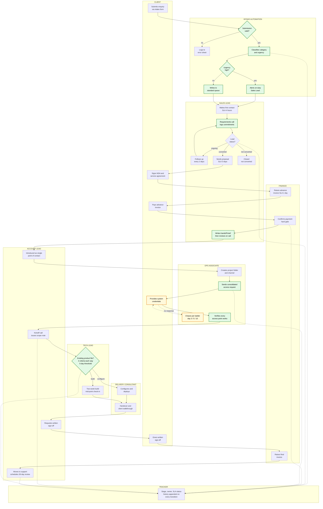

# Future State: Client Onboarding

**Document:** 05 of 05 - Future State Map
**Version:** 1.0
**Changes applied:** R1 through R5 from `04-improvement-memo.md`

---

## What changed

| ID | Change | Visible in the map as |
|---|---|---|
| R1 | Automated intake with single named owner | New automation lane replacing the broadcast alert |
| R2 | Tracker with retained stage history | Tracker lane, written to at each stage transition |
| R3 | Mandatory written handoff brief | Brief produced before the handoff call, not after |
| R4 | Consolidated access request, escalation ladder, clock pause | Pause marker and ladder on the access step |
| R5 | Documented build-versus-configure criteria | Decision node now references written criteria |

---

## Future-state map

**Green nodes** are steps changed by R1 to R5. **Amber nodes** are the client-dependent
access step where the engagement clock pauses and the escalation ladder runs.

---

## Before and after, by pain point

### P1 - Enquiry alert has no named owner

**Before:** alert fires to sales leads, ops, and managers at once. No owner, no clock,
no record of who acted.

**After:** intake automation assigns one named on-duty Sales Lead. Assignment is
timestamped, so the 4-hour first-contact SLA is measurable. High-urgency enquiries alert
immediately; everything else lands in a queue reviewed daily.

### P2 - Leads sheet holds status but no history

**Before:** a single status field, overwritten. Follow-up cadence unenforceable, cycle
time unmeasurable.

**After:** tracker retains a dated history of every stage transition. Follow-up compliance
is visible, SLA breaches flag at 80 percent of allowed time, and average days per stage
shows where the process loses time.

### P3 - Sales-to-delivery handoff is verbal and lossy

**Before:** a call transferring whatever the Sales Lead remembers. Nothing written.

**After:** a written brief is the deliverable and the call reviews it. Commitments made
during sales are recorded at the time they are made. Scope disputes resolve against a
record rather than recollection.

### P4 - Access delays are untracked and unescalated

**Before:** invisible dependency. No chase owner, no threshold, delay wrongly attributed
to delivery.

**After:** one consolidated request, an escalation ladder at day 3, 5, and 10, and a clock
pause that moves the delivery date by exactly the delay the client caused. Verification is
separated from provisioning, so credential failures surface before kickoff rather than
during it.

### P5 - Build-versus-configure decision has no stated criteria

**Before:** undocumented judgement. Unauditable, non-transferable, quietly biased toward
configuring under pressure.

**After:** four criteria each way with a 5-day effort threshold. Decision and reasoning
recorded, reviewed at the 30-day review. The decision remains a human judgement - see
section 6 of the improvement memo for why automating it was rejected.

---

## What the map does not show

**The 30-day review loop.** Step 24 schedules a review that feeds back into the criteria
at step 18 and into the SLA reference table. Drawing that edge would make the map harder
to read, but the loop is the mechanism by which this process improves rather than
ossifying.

**Exception paths.** E1 through E5 in the SOP cover unresponsive clients, failed access,
scope change, non-payment, and repeated kickoff rescheduling. Each is a branch that would
triple the node count. The map shows the intended path; the SOP covers what happens when
it does not hold.

**Volume limits.** The tracker is manual. Past roughly 30 live engagements it stops being
reliable, and the process would need a different tool rather than a different design.
